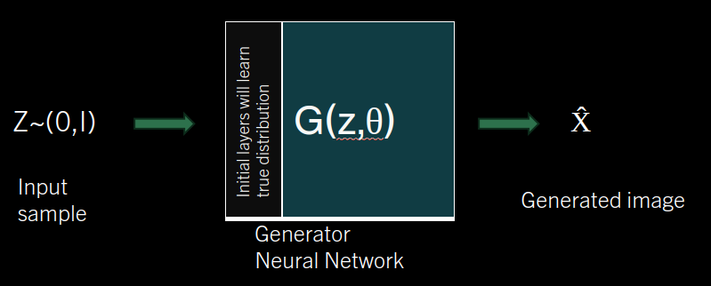
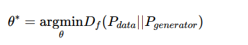
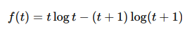
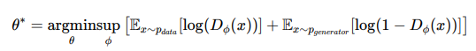

<h3>GAN</h3>
In this project does implementation and evaluation og generative model GAN. 
This propject was part of my curriculam I did in iisc of course advance deep generaative model, taught by pratosh sir.

GAN overview. 
GAN is generative model. We have image data {(xi)}i=1N , where N is number of images we have and xi &in; Rd. and these images are the samples from P(x). Aim of generative model is to estimate the P(x) using the training data and sample new data points from it. 

GAN stands for generative adverserial network. In which we do adverserial traing to train our model to generate the images. we train our model by assuming that images are generated from some lover dimensional subspace which has some distribution. And we train the model to learn that distribution from which images are generated. For that we assume some distribution and try to minimise the difference between the true and the assumed distribution. To measure the difference between two distrubution we use family of f-divergence specificaly we used Jensen-Shannon (JS) divergence. 

JSD(P||Q) = (KL(P||M)+KL(Q||M))/2

and M = (P+Q)/2

and  KL(P||M) is Kullback-Leibler divergence between P AND M. 

KL(P || M) = ∫ p(x) * log(p(x)/q(x)) dx -- kl divergence for contineous function.

In GAN we aims to minimise the JS divergence between true distribution and the the distribution we are learning.

But wait if we know true distribution why to learn the new distribution. Actually we don't know the true distribution. we assumed the distribution is cpmming from the normal distribution. 
But this is hardcoding the assumption, what if the true data is not comming from the normal distribution. No worries during the traing of our neural network the starting layer of neural network will learn the true distribution. but is this valid to say? yes because as per the universal approximation theorem a large neural network can able to learn any function. and our learning objective will take care of all this. 

let θ be the parameter of generator, which take input z~N(0,I) normal dstribution

the generator is learning the distribution as well as doin sampleling to generate the image.
we try to learn the optimal parameter θ* which minimise the js divergence between the true distribution and the approximate distribution via the neural network. 

after simplifying we get below expression for the θ*. 

where   
θ - parameter of generator network,  
Φ - parameter of critic network,  
Ex~pdata - expection over real data distribution.  
Ex~pgenerator - expection over generator's data distribution.  
f* - convex conjugate of the divergence function.  
TΦ(x) - discriminator function parameterized by Φ.  
For the js divergence 

and further simplifying we get

where DΦ(x) gives output of critic network between 0 and 1.  

our objkecive is such that to get θ* we try to maximise the objective function w.r.t. Φ and minimise w.r.t. θ.
when we give true image ie x~pdata only first term will be concidered, then to maximise w.r.t  Φ we want the first parameter to be maximise so DΦ(x) must be 1, and when x~pgenerator then the second term will be considered then to maximise w.r.t  Φ we want the second parameter to be minimise so DΦ(X̂) must be = 0. so for true image critic will try to maximise the output and for generated image by generator the critic will try to minimise the output. thus there is an adverserial training going on here. thus named generative adverserial network. 

### WGAN
Also called Wasserstein GAN. Instead of using the JS divergence to measure the distance between true distributions, we use Earth-Mover (EM) distance. The problem with JS divergence is that it does not penalize the difference well.

### Frechet Inception Distance (FID)
Frechet Inception Distance (FID) is a metric used to measure the quality of images generated by a GAN. It measures how similar the generated image is with respect to the true image.

To measure the FID score, we use a pretrained model that is trained on a very large dataset. The generated image and the true image are passed through this model, and we collect the output from one of its intermediate layers. The distance between these outputs is then calculated. A lower FID indicates better image generation.

### Implementation Details

thse dataset can be downloaded from 

For butterfly images: https://www.kaggle.com/datasets/phucthaiv02/butterfly-image-classification.

For animal images: https://www.kaggle.com/datasets/iamsouravbanerjee/animal-image-dataset-90-different-animals.

Since per class image is less in animal dataset I did data agumentation to increase the data size.
