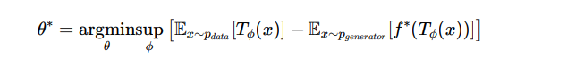

# GAN Overview

Generative Adversarial Networks (GANs) are a class of generative models used to learn the distribution of data and generate new samples from that distribution. The objective of a GAN is to estimate the true data distribution, P(x) , based on a given training dataset consisting of images \( \{  xi \}{i=1 to N} \), where  \( xi ∈ Rd
\), and \( N \) is the total number of images.

## What is a GAN?

GAN stands for **Generative Adversarial Network**, and it works by employing a novel approach called **adversarial training**. The idea behind GANs is to train a model to generate images by assuming that the data is drawn from a lower-dimensional subspace with some underlying distribution. The model is then trained to learn this distribution by minimizing the difference between the true distribution and the assumed distribution.

To measure the difference between the true distribution \( P(x) \) and the assumed distribution \( Q(x) \), we use the **Jensen-Shannon Divergence (JSD)**, which is a type of f-divergence:

$$
JSD(P || Q) = \frac{1}{2} \left( KL(P || M) + KL(Q || M) \right)
$$

Where:

$$
M = \frac{P + Q}{2}
$$

And:

$$
KL(P || M)
$$

## Goal of GAN

In GANs, our goal is to minimize the **Jensen-Shannon Divergence** between the true distribution \( P(x) \) and the distribution we are learning, represented by \( Q(x) \). 

### Why Learn a New Distribution?

You might wonder: *"If we already know the true distribution \( P(x) \), why bother learning a new distribution?"* 

The key point is that **we don't know the true distribution** in real-world problems. The assumption is often that the data comes from a normal distribution, but this is a simplification and not necessarily true.

The beauty of GANs is that during the training process, the neural network will learn the true underlying distribution. This is because, as per the **Universal Approximation Theorem**, a sufficiently large neural network can approximate any function. Hence, the model can adjust and learn the true distribution through adversarial training.

## Conclusion

To summarize, GANs are powerful models that learn the data distribution by training a neural network using adversarial methods. They aim to minimize the difference between the true distribution and the learned distribution, ultimately generating new samples that resemble the original data.

# Maathematical aspects.

Let θ be the parameter of the generator, which takes input \( z \sim \mathcal{N}(0, I) \) (a normal distribution).

The generator is learning the distribution as well as performing sampling to generate the image. We try to learn the optimal parameter \( θ^* \), which minimizes the Jensen-Shannon (JS) divergence between the true distribution and the approximate distribution via the neural network.

After simplifying, we get the following expression for \( θ^* \):

Where:
- \( θ \) - parameter of the generator network,
- \( Φ \) - parameter of the critic (discriminator) network,
- \( \mathbb{E}x ~ pdata \) - expectation over the real data distribution,
- \( \mathbb{E}x ~ pgenerator \) - expectation over the generator's data distribution,
- \( f^* \) - convex conjugate of the divergence function,
- \( TΦ(x) \) - discriminator function parameterized by \( Φ \).

For the JS divergence, we have:

And further simplifying, we get:

Where \( DΦ(x) \) gives the output of the critic network, which ranges between 0 and 1.

### Objective and Training

Our objective is to find \( θ^* \) by maximizing the objective function with respect to \( Φ \) and minimizing with respect to \( θ \). The process works as follows:

- When we provide a true image (\( x \sim pdata \)), only the first term will be considered. To maximize with respect to \( Φ \), we want the first term to be maximized, so \( DΦ(x) \) must be 1.
- When \( x \sim pgenerator \), the second term will be considered. To maximize with respect to \( Φ \), we want the second term to be minimized, so \( DΦ(\hat{x}) \) must be 0.

Thus, for true images, the critic will try to maximize the output, and for generated images, the critic will try to minimize the output. This adversarial training process leads to the creation of a **Generative Adversarial Network**.

### Summary

The GAN framework uses adversarial training, where the generator and critic network continuously improve by optimizing each other's performance. The generator aims to create realistic data, while the critic evaluates and guides the generator's learning process.

### WGAN
Also called Wasserstein GAN. Instead of using the JS divergence to measure the distance between true distributions, we use Earth-Mover (EM) distance. The problem with JS divergence is that it does not penalize the difference well.

### Frechet Inception Distance (FID)
Frechet Inception Distance (FID) is a metric used to measure the quality of images generated by a GAN. It measures how similar the generated image is with respect to the true image.

To measure the FID score, we use a pretrained model that is trained on a very large dataset. The generated image and the true image are passed through this model, and we collect the output from one of its intermediate layers. The distance between these outputs is then calculated. A lower FID indicates better image generation.

### Implementation Details

thse dataset can be downloaded from 

For butterfly images: https://www.kaggle.com/datasets/phucthaiv02/butterfly-image-classification.

For animal images: https://www.kaggle.com/datasets/iamsouravbanerjee/animal-image-dataset-90-different-animals.

Since per class image is less in animal dataset I did data agumentation to increase the data size.
